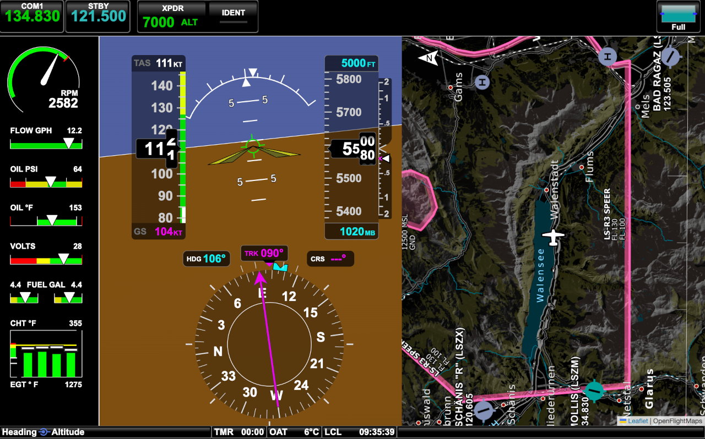

# SDU460
This project aims at replicating a well-known touch-based flight instrument for the purpose of desktop flight simulation. In particular it is designed as a standalone 'instrument' to be run on a RaspberryPI in combination with a touch-based monitor alongside the normal flight simulation PC. Currently the open-source flight simulator FlightGear is supported as data source.

</img>

## Background and current status
First and foremost, this project is one hobbyist's endeavor for the joy of flying at home. It is *not* associated with any avionics manufacturer in any way and does *not* use any resources (source code or preexisting artwork). Instead, everything is written from scratch, based on pure web standards and ES6 JavaScript. This software works without any 3rd party library apart from leaflet and leaflet-rotate for map display. Feel free to either use npm to install these dependencies or do it manually. 

As moving map, any maps in tiles format can be used. For current testing purposes, I opted for openflightmaps due to their availability in many regions.

## Known deviations

Currently the functionality is limited to the demands that I have as a pure VFR pilot that enjoys to train procedures at home, whenever possible. Therefore, everything displayed on screen is functional (all the dials, heading indicators, engine parameters, etc.) but advanced functions are not (yet) available. Mostly data is streamed from the flight simulator to this software and is visualized accordingly. However, both the transponder and the COM1 radio is controllable via touch interaction.

Main deviations from the original instrument's appearance:
- Different screen size (10.4" vs. 10.1") as well as different aspect ratio (1280x768 vs. 1280x800). Therefore, my screen is slightly smaller in diagonal and has 32 pixels more in vertical dimension.

Plans for further development (hardware):
- Physical dual-axis rotary encoder for heading and altitude bug.
- 3d printed bezel to cover the 10.1" screen.

Plans for further development (software):
- OBS display and VOR functionality.
- CDI with flight plan upload

## Installation and running
If you have nodejs installed, this the following command from the project's root directory:

$ npm -i

Further, download and extract the correct tiles for your area. Mine is Switzerland so I can just run the following command:

$ ./download3rdParty.sh

But please replace the content of openflightmaps/ with the tiles of your choice.

Finally, run FlightGear with the --http=8080 option. Currently the websocket/REST endpoint is hardcoded to localhost:8080 in the file SimInterface/FlightGear.js

You can change this according to your needs.
